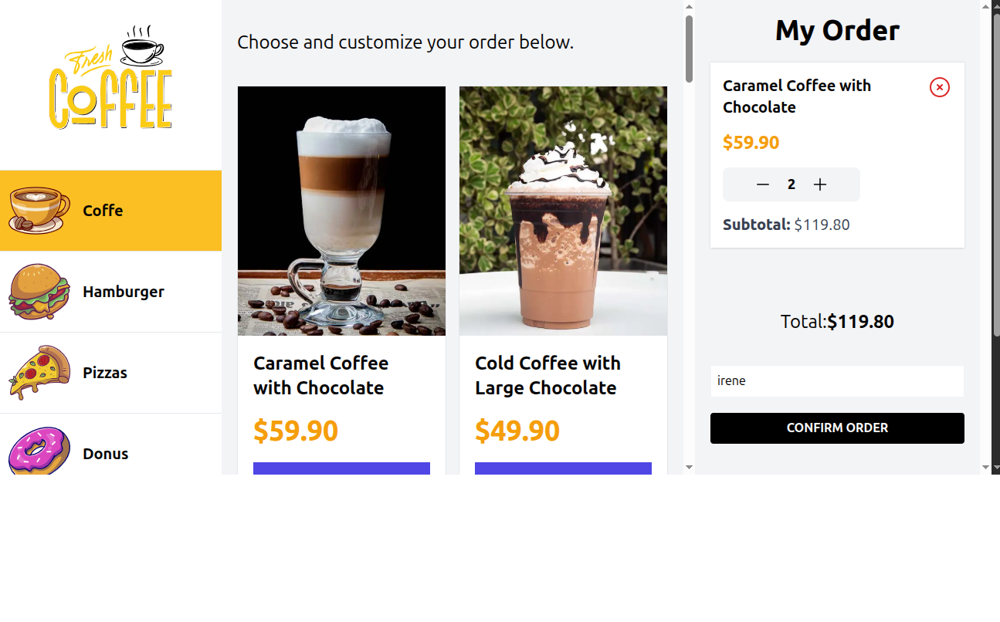
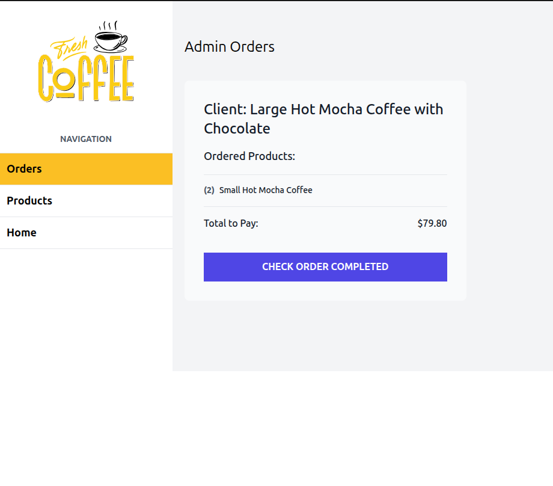
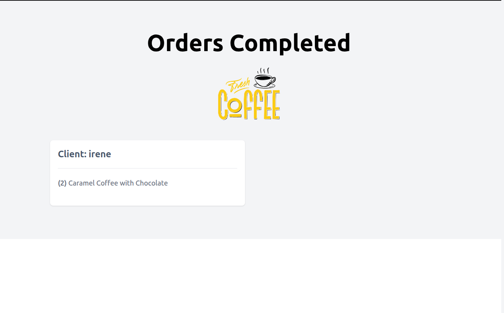

# Restaurant Shop

A modern web application designed to simplify the ordering process at a restaurant. Customers can browse different food categories and place orders, while administrators can manage products and orders through a powerful admin panel.

## ✨ Features

### Customer Features
- **Online Ordering**: Browse and order food from various categories (coffee, pizzas, hamburgers, donuts, cakes, cookies)
- **Real-time Updates**: Track your order status in real-time
- **Category Navigation**: Easy browsing by food categories with intuitive icons
- **Order History**: View your past orders

### Admin Panel Features
- **Product Management**: Add, edit, and delete products
- **Image Upload**: Upload product images using Cloudinary integration
- **Order Management**: View and manage all customer orders
- **Category Management**: Organize products by categories
- **Order Status**: Mark orders as complete when ready

## 🛠 Technologies Used

- **Next.js 14**: Modern React framework with App Router
- **TypeScript**: Type-safe development
- **Tailwind CSS**: Utility-first CSS framework for styling
- **Prisma**: Database ORM with PostgreSQL
- **Zustand**: Lightweight state management
- **Zod**: Schema validation for forms and data
- **Cloudinary**: Cloud-based image upload and management
- **SWR**: Data fetching and caching
- **React Icons**: Beautiful icons for the interface
- **React Toastify**: User notifications

## Image Management with Cloudinary

The application uses **Cloudinary** for efficient image handling:

- **Cloud Storage**: All product images are stored in the cloud
- **Image Optimization**: Automatic image compression and optimization
- **Easy Upload**: Drag-and-drop interface for admins to upload product images
- **Responsive Images**: Automatically serves appropriate image sizes
- **Fast Loading**: CDN delivery ensures quick image loading worldwide

Administrators can easily upload new product images or update existing ones through the admin panel.

## 🚀 Installation

Follow these steps to run the project locally:

### Prerequisites
- Node.js (v18 or higher)
- PostgreSQL database
- Cloudinary account (for image uploads)

### Setup Steps

1. **Clone the Repository**:
   ```bash
   git clone https://github.com/your-repo/restaurant-shop.git
   cd restaurant-shop
   ```

2. **Install Dependencies**:
   ```bash
   npm install
   ```

3. **Environment Variables**:
   Create a `.env` file and add:
   ```env
   DATABASE_URL="your-postgresql-connection-string"
   NEXT_PUBLIC_CLOUDINARY_CLOUD_NAME="your-cloudinary-cloud-name"
   NEXT_PUBLIC_CLOUDINARY_API_KEY=
   CLOUDINARY_API_SECRET=
   ```


4. **Database Setup**:
   ```bash
   npx prisma migrate dev
   npx prisma db seed
   ```

5. **Start the Application**:
   ```bash
   npm run dev
   ```

6. **Access the App**:
   - Customer site: `http://localhost:3000`
   - Admin panel: `http://localhost:3000/admin/products`

## 🌐 Live Demo

- **🏪 [Customer Store](https://restaurant-shop.vercel.app/)** - Browse and order products



- **👨‍💼 [Admin Panel](https://restaurant-shop.vercel.app/admin/orders)** - Manage orders and products



- **📋 [View Orders](https://restaurant-shop.vercel.app/orders)** - Check order status



## 📁 Project Structure

```
├── app/                    # Next.js App Router pages
├── components/             # Reusable React components
├── actions/               # Server actions
├── prisma/                # Database schema and migrations
├── public/                # Static assets (images, icons)
├── src/                   # Source code (utils, types, store)
└── package.json           # Dependencies and scripts
```

## 🎨 Features in Detail

### Admin Dashboard
- **Product CRUD**: Complete product management system
- **Image Upload**: Seamless integration with Cloudinary
- **Order Tracking**: Monitor all customer orders
- **Search & Filter**: Find products and orders quickly

### Customer Experience
- **Responsive Design**: Works perfectly on all devices
- **Intuitive Navigation**: Easy category browsing
- **Real-time Feedback**: Instant notifications and updates
- **Order Management**: Track orders from placement to completion

